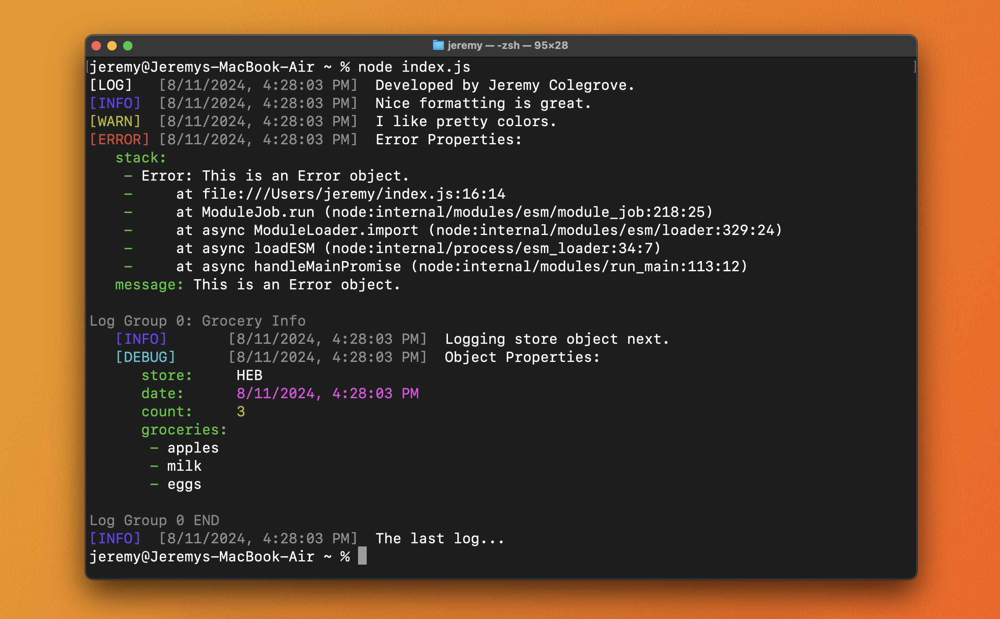

# 🌟 formatted-logger

A beautifully customizable and fast logger for Node.js that formats messages with style, prints objects in YAML format, and allows for flexible piping of output. Perfect for projects where you need logs that not only provide valuable information but also look great! Better yet, everything is fully typed and documented.
### Key Features:

- **Date Formatting:** Customize how dates appear in logs using the `dateTransformer` option.
- **Piping:** Redirect logs to any destination (file, server, etc.) with the `pipe` callback.
- **YAML Output:** Toggle YAML formatting with `yamlOptions.enabled`, and customize every aspect, from colors to indentation.
- **Color Control:** Complete control over log colors, from keys to values, and everything in between. We support all colors from `colors.js`.
- **Array Formatting:** Save space with inline arrays, perfect for logs with large arrays.
- **Fully Typed:** All methods and variables are fully typed, meaning you don't have to guess what goes where. With CJS and ESM support, this package is plug and play.
## 🚀 Installation

Get started with `formatted-logger` in just a few seconds!

```bash
npm i formatted-logger
```

## 🛠 Getting Started

To use `formatted-logger`, simply instantiate it with your desired options:

```javascript
import FormattedLogger from 'formatted-logger'
// OR const FormattedLogger = require('formatted-logger')

var logger = new FormattedLogger({
    // Your custom options here
});

logger.warn("Failed to retrieve JSON from API");
```

This will log a warning with the current timestamp, formatted according to your preferences.

## 📸 Example

Here’s what your logs could look like:



_... and many more customizations are available!_
## 🌟 Why Choose formatted-logger?

There’s no shortage of loggers out there, but `formatted-logger` stands out for its nice format and customizability. Plus, it's fast and flexible, making it ideal for those who appreciate well-structured and colorful logs.

## 🌍 Supported Environments

`formatted-logger` is designed to work in all environments where JavaScript is running—whether it’s Node.js, a browser, or a serverless function.

## 🎨 Customization

`formatted-logger` is built with flexibility in mind, allowing you to customize nearly every aspect of your logging experience. Below, you’ll find explanations of the key options available, along with example configurations to help you get started.

### `groupIndentation`
- **Description:** Controls the number of spaces used for indentation when grouping logs.
- **Default:** `3`
- **Example:**
  ```javascript
  const logger = new FormattedLogger({
      groupIndentation: 4 // Indents groups with 4 spaces instead of 3
  });
  logger.group("Starting process").log("Process initiated").ungroup();
  ```

### `dateTransformer`
- **Description:** A callback function that formats the output of a date object. Customize how timestamps appear by passing your own function.
- **Default:** ISO string format.
- **Example:**
  ```javascript
  const logger = new FormattedLogger({
      dateTransformer: (date) => date.toLocaleString() // Use a localized date string
  });
  logger.info("This log has a custom date format");
  ```

### `logLevels`
- **Description:** An array of log levels that should be output. Use this to control which types of logs are shown.
- **Default:** `['error', 'debug', 'log', 'warn', 'info']`
- **Example:**
  ```javascript
  const logger = new FormattedLogger({
      logLevels: ['error', 'warn'] // Only output error and warning logs
  });
  logger.debug("This won't be shown").error("This will be shown");
  ```

### `yamlOptions`
- **Description:** Configuration options for YAML formatting of objects and arrays. This includes indentation, color settings, and whether to enable YAML formatting.
- **Default:** Various defaults (see below).
- **Example:**
  ```javascript
  const logger = new FormattedLogger({
      yamlOptions: {
          enabled: true,
          indentationCharacter: '>', // Use '>' instead of spaces for indentation
          colors: {
              keys: 'cyan',
              string: 'green',
              number: 'yellow',
              ...
          },
          inlineArrays: true // Display arrays in a single line
          alignKeyValues:true
      }
  });
  logger.log({ key: "value", list: [1, 2, 3] });
  ```

### `noColor`
- **Description:** Disables color in logs. Useful when outputting to files or other non-terminal destinations. You can also choose to keep colors in the logs and use `FormattedLogger.stripColors(...args)` to remove all colors. 
- **Default:** `false`
- **Example:**
  ```javascript
  const logger = new FormattedLogger({
      noColor: true // Disable color in logs
  });
  logger.info("This log will have no color");
  ```

### `autoGroup`
- **Description:** Automatically groups multiple messages into a single group when logging them together.
- **Default:** `true`
- **Example:**
  ```javascript
  const logger = new FormattedLogger({
      autoGroup: false // Disable automatic grouping
  });
  logger.log("Message 1", "Message 2", "Message 3"); // Each message is logged separately
  ```

### `pipe`
- **Description:** A callback function to handle the log output. Use this to redirect logs to a file, a server, or any other destination.
- **Default:** Outputs to the console.
- **Example:**
  ```javascript
  const fs = require('fs');
  const logStream = fs.createWriteStream('log.txt', { flags: 'a' });

  const logger = new FormattedLogger({
      pipe: (log) => logStream.write(log + '\n') // Write logs to a file
  });
  logger.info("This log will be written to a file");
  ```

With these options, you can make `formatted-logger` fit perfectly into your project’s needs. Whether you need colorful, grouped logs for the console or neatly formatted text files, `formatted-logger` gives you the power to customize it all.


## 🔧 Acknowledgments & Contributions

The YAML printing feature of `formatted-logger` is built on top of the amazing work done by the `prettyoutput` library by keepitcool, which in turn was inspired by `prettyjson` by rafeca, as well as the `colors` library. Huge thanks to these projects for laying the groundwork.

Want to contribute? Yes please!
